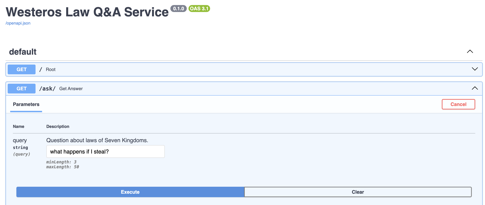
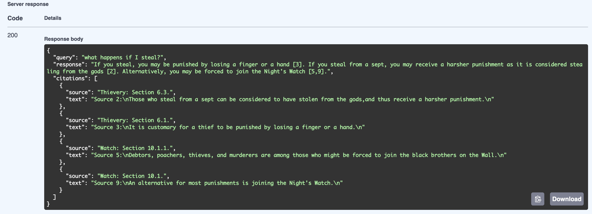

# Norm Ai Westeros Seven Kingdoms Law Q&A Service

This repository contains backend and frontend code to host an AI-powered Q&A service for the laws governing the Seven Kingdoms of Westeros.

## Setup

### 1. Environmental variables

After cloning the repository, create a `.env` file that contains the following variables:

1. OPENAI_API_KEY (str): API key for sending RAG queries to LLMs hosted in OpenAI API.
2. DOCUMENT_FILE (str): Relative path to the file containing the laws to populate our document vector store. Some important assumptions are listed below:
    a. The document parser expects all relevant laws to be contained in a single file - please pass only a single file, not a directory.
    b. The parser assumes that the law document is in PDF format - please format the relevant document file as PDF.
3. LLM_MODEL_NAME (str): OpenAI LLM alias to use for generating RAG responses to questions (default: `gpt-4`).
4. SIMILARITY_TOP_K (int): Vector retrieval hyperparameter that sets how many documents are retrieved from the vector store as candidates to populate the LLM prompt context. (default: `10`)
5. SIMILARITY_CUTOFF (float): Vector retrieval post-processing hyperparameter applied during document retrieval to filter out less relevant documents before they are passed as context to the LLM for generation. Values are between `0.0-1.0` - higher values are more restrictive on similarity and filters out more documents (default: `0.8`).

See example below:

```shell
OPENAI_API_KEY="your-api-key"
DOCUMENT_FILE="docs/laws.pdf"
LLM_MODEL_NAME="gpt-4"
SIMILARITY_TOP_K=10
SIMILARITY_CUTOFF=0.75
```

### 2. Building Docker image and launching service locally

Once the `.env` file is created, please run the convenience script `launch_app.sh` that builds the Docker image for the service and launches a container locally.

Before running the script, two more environmental variables must be set:

1. CONTAINER_IMAGE (str): the name of the image and container that will be locally built and launched, respectively.
2. HOST_PORT (str): the host port number to expose for the backend service. The container exposed port is port 80.

See example below:

```shell
export CONTAINER_IMAGE="norm-fullstack"
export HOST_PORT=80
```

If the script runs successfully, there should be no error messages. Also, the image hash and the following message should appear in the terminal:

```shell
Docker container '$CONTAINER_IMAGE' launched, mapped port $HOST_PORT to port 80.
```

### 3. Using the service

Since the server is built using FastAPI, the Q&A service can be accessed via the Swagger documentation page. After launching the containerized service locally in step 2, open a web browser and navigate to `localhost:$HOST_PORT/docs` in the search bar. The `HOST_PORT` is the value of `HOST_PORT` that you set as an environment variable in part 2.

The endpoint for passing questions to the Q&A service is the `GET /ask` endpoint. It is the second drop-down tab under the `default` endpoints tab:



The endpoint expects a mandatory query argument `query` - a question about any of the laws of the Seven Kingdoms (e.g. what happens if I steal?). Successful responses will return the answer to the client's question including citations that reference the corresponding laws from the law document passed in `DOCUMENT_FILE`:



Some interesting edge cases to also try out:
    1. Empty query - the service should return a 400 response w/ the detail `Query was empty.`
    2. Queries regarding laws not contained in the document (e.g. `what happens if I steal a car?`) - the response should explain that no relevant laws explain what happens if a car is stolen.

## Appendix

The appendix contains some assumptions and design choices made (with justifications) for the different components of the Q&A service.

### 1. Law document vector store initialization

#### 1a. Parsing strategy

As mentioned in section 1, the document parser expects the relevant documents to be contained in a single, text-only PDF file. It also assumes that the law document follows a standardized structure with law topics encased in enumerated sections (e.g. **1. Peace**) and the corresponding laws listed under each section (e.g. **2.1 king Maegor raised a set of laws that which forbade holy men from carrying arms**).

Under these assumptions, a PDF parsing module was used instead of an LLM to extract and divide the laws into documents. Parsing modules are best-suited for standard, text-based document structure whereas LLMs are better suited to parse unstructured documents w/ mixed modalities (e.g. text, images) at the expense of API usage costs and uncertainties on data privacy and latency.

#### 1b. Document construction

Each document in the vector store encases a particular law (e.g. **3.1 The Widow's law reaffirms the right of the eldest son (or eldest daughter, if there are no sons) to inherit**). Since the answers returned by the Q&A service must contain individual citations from the set of laws, each document should ideally capture the smallest granularity of possible references, which would be individual laws.

The metadata of each document (i.e. law) contains the following information:
    1. Law topic (str) - the general topic of the law's section (e.g. **3. Widows**)
    2. Section number (str) - the law's enumerated section number - this value is provided back to the client so that they can reference the original document (e.g. **3.1.2**)
    3. Parent laws (list[str]) - an ordered list (hierarchy) of parent laws that the law is derived from

Each law's section can be conceptualized as a tree. See the example below for setion **3. Widows**:

- 3. Widows
  - 3.1 The Widow's law reaffirms the right of the eldest son (or eldest daughter, if there are no sons to inherit)
    - 3.1.1 However, the law requires the heirs to maintain their father's surviving widow...
    - 3.1.2 The widows could no longer be driven from their late husband's castle...
    - 3.1.3 The law similarily prevented men from disinheriting the children from an earlier marriage...

In other words, each nested law inherits its context from its parent laws (e.g. for law 3.1.2, its parent laws is **3.1 The Widow's law reaffirms the right of the eldest son (or eldest daughter, if there are no sons) to inherit**). Therefore, each law's hierarchy of parent laws (if applicable) was appended to the metadata in order to provide additional context during document retrieval.

In contrast to retrieval step, each law's parent law hierarchy is removed from the LLM context. This operation ensures that duplicate laws aren't passed to the LLM (i.e. reduce input context tokens). It also allows the LLM to focus its attention uniformly across each unique law vs having overexposure to parent laws with very deep child law hierarchies.

### 2. Document retrieval implementation

#### 2a. Selecting top k hyperparameter

The number of documents retrieved per query (`SIMLIARITY_TOP_K`) was chosen to be relatively large compared to the number of documents in the corpus (i.e. `SIMLIARITY_TOP_K=10`, 31 documents in vector index). The reasoning was to account for certain questions that needed to reference laws from different sections. For example, an appropriate answer for "What happens if I steal?" should reference 4 laws from sections **2. Thievery** and **10. Watch** (i.e. thieves might be forced to join the Night's Watch). If the value of `SIMLIARITY_TOP_K` is smaller than 4, then the question couldn't be answered in its full entirety. Therefore, large values of `k` would increase the likelihood of capturing all relevant laws (i.e. high recall) at the expense of some "noise" (i.e. irrelevant laws).

#### 2b. Using vector similarity as a filter

In order to reduce the amount of noise in the larger sample of retrieved documents, a similarity cutoff hyperparameter (`SIMLIARITY_CUTOFF=0.75`) was used to filter out retrieved laws that are below a certain similarity threshold before the retrieval context is passed to the LLM for generation. Higher thresholds (i.e. closer to `1.0`) will significantly reduce the retrieved context but preserve the most similar laws. Lower thresholds (i.e. closer to `0.0`) will keep most of the documents and rely on the LLM to filter out the least relevant documents. This hyperparameter can be tuned, depending on the retrieval performance.

### 3. Citation response post-processing

After an answer w/ citations is generated for the client's question, an additional citation filtering step is applied to only include the laws that were cited in the LLM response. The LLM doesn't rely on every retrieved citation in the context when answering the client's question. Therefore, only the laws that were directly cited in the answer were returned in the response to avoid confusion on the client's side.

## Reflection

There are two main challenges in building, integrating, and maintaining AI regulatory agents for legal compliance.

The first challenge that I foresee is building appropriate middleware and infrastructure to handle ingestion, preprocessing, and storage of legal documents. I anticipate many legal documents to originate from legacy systems such that integrating the technology w/ modern data warehousing systems to have very high friction. Furthermore, I also expect the representation of these legal documents to be difficult to scale (i.e. PDF, docx files, image scans of typed or hand-written docuemnts). In order to transition the data storage to modern systems, I would implement a modularized data piopeline that would de-couple the data pre-processing from the AI tooling and infrastructure layesr. Specfically, I would design the upstream pipeline to be broad and wide to cover as many data representations as possible and the downstream pipeline to be narrower as the data representations closest to the AI layers are more standardized and ready for analysis by the LLMs.

The second challenge that I foresee is formalizing protocols for explainability and fact-checking of AI-generated compliance reports. I expect legal documents to be intentionally very syntactically and semantically complex. As a result, I think that identifying compliance or violations could be very challenging for LLMs that don't have a lot of exposure to analyze legal documents. For this use case, I see a lot of value in implementing advanced LLM workflow design patterns (e.g. generation + revision, orchestator + workers, etc.) to allow AI systems and legal experts to incrementally and collaboratively assess compliance until the LLMs are proven to be more reliable at this task.